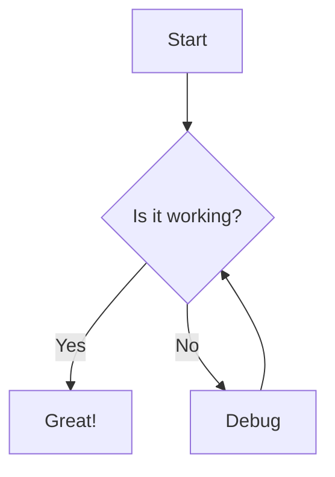
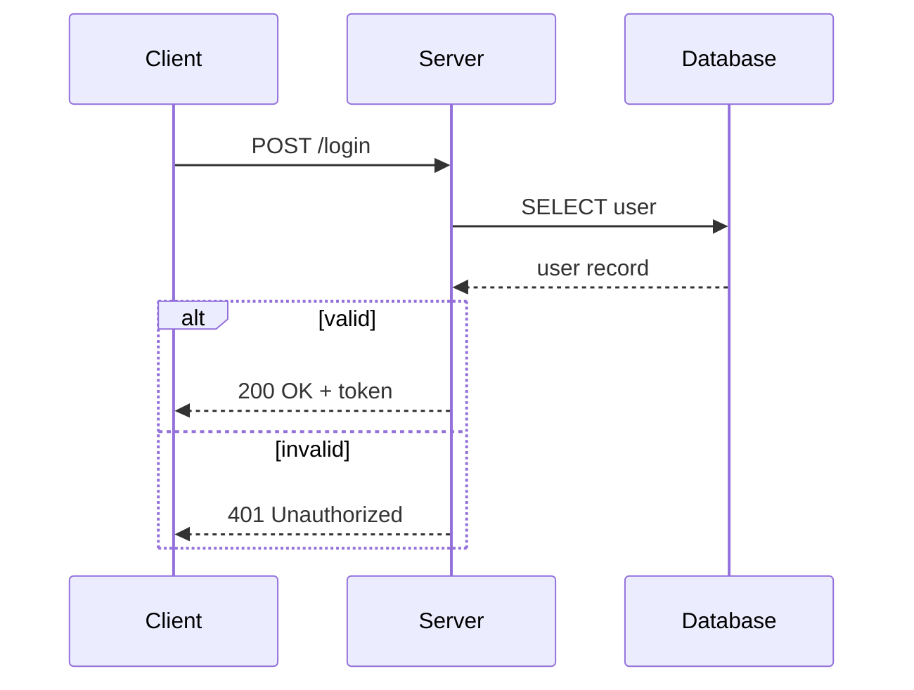
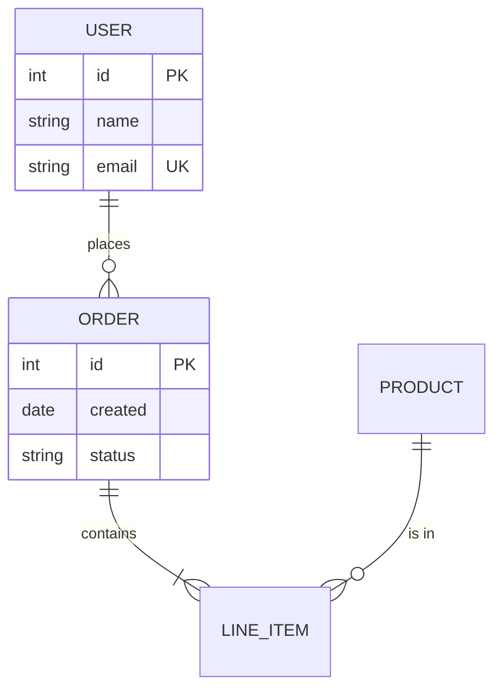
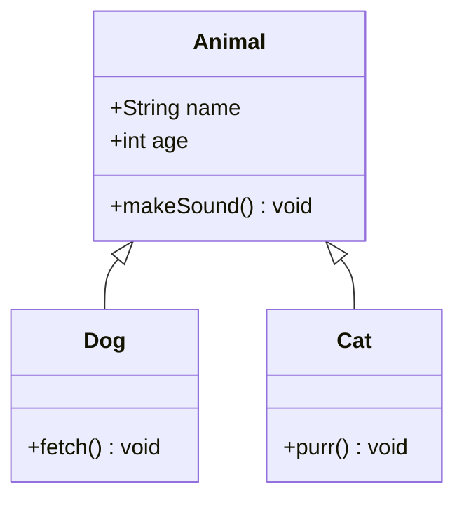
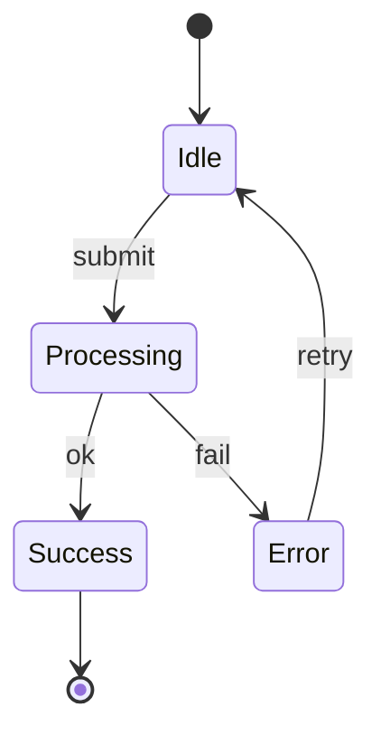
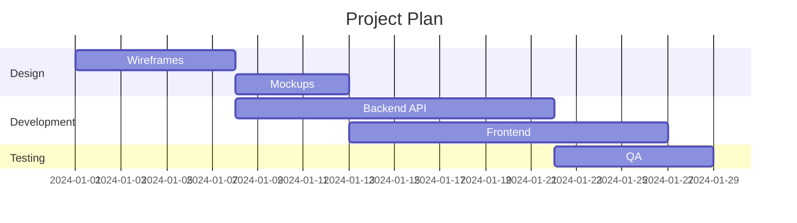
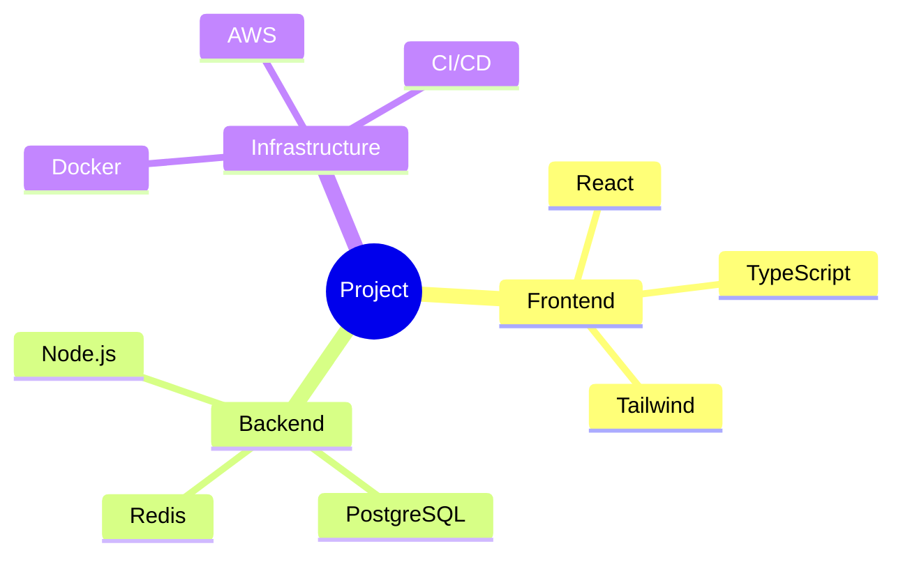
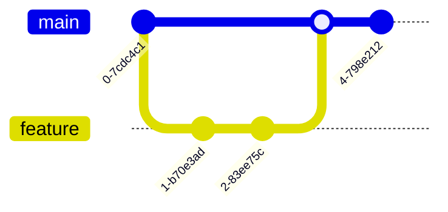
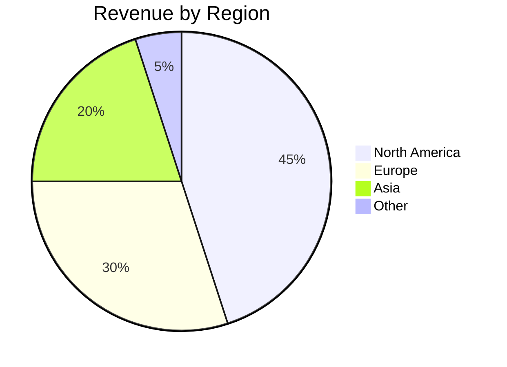
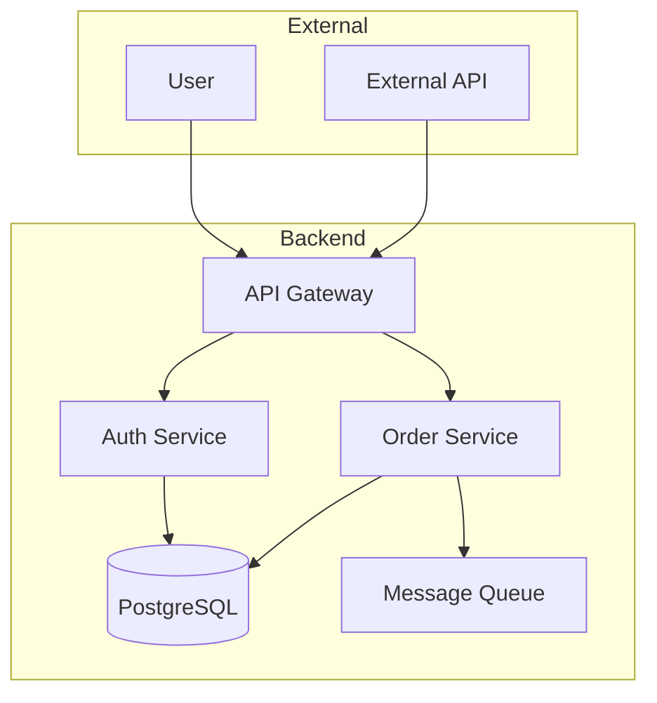

# Diagrams with Mermaid

Generate diagrams by writing Mermaid syntax to a `.mmd` file, then rendering with `mmdc`.

## Rendering

```bash
# Write diagram to temp file, render to outbox
cat > /tmp/diagram.mmd << 'EOF'
graph TD
  A[Start] --> B{Decision}
  B -->|Yes| C[Do something]
  B -->|No| D[Do other thing]
EOF
mmdc -i /tmp/diagram.mmd -o outbox/diagram.png -b transparent -p /root/.puppeteerrc.json
```

### Options

| Flag | Description |
|------|-------------|
| `-i <file>` | Input `.mmd` file |
| `-o <file>` | Output file (`.png`, `.svg`, `.pdf`) |
| `-b <color>` | Background color (`transparent`, `white`, `#hex`) |
| `-t <theme>` | Theme: `default`, `dark`, `forest`, `neutral` |
| `-w <px>` | Width in pixels (default: 800) |
| `-s <scale>` | Scale factor (default: 1, use 2 for high-res) |

Always use `-b transparent` or `-b white` for clean output.

## Diagram types

### Flowchart



Direction: `TD` (top-down), `LR` (left-right), `BT`, `RL`.

Node shapes: `[rectangle]`, `(rounded)`, `{diamond}`, `([stadium])`, `[[subroutine]]`, `[(cylinder)]`, `((circle))`.

### Sequence diagram



Arrows: `->>` (solid), `-->>` (dashed), `--)` (async).

### Entity-relationship diagram



Cardinality: `||` (one), `o{` (zero or more), `|{` (one or more), `o|` (zero or one).

### Class diagram



### State diagram



### Gantt chart



### Mind map



### Git graph



### Pie chart



### Architecture / C4 (using flowchart)



Use `subgraph` blocks for grouping components.

## Tips

- Keep diagrams focused — one concept per diagram
- Use aliases for long names: `participant S as AuthService`
- Use `subgraph` to group related nodes
- For high-res output use `-s 2`
- Always output to `outbox/` for delivery back to chat
